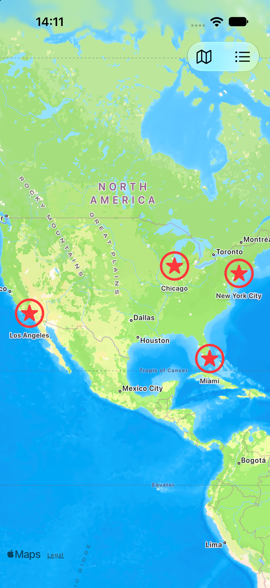
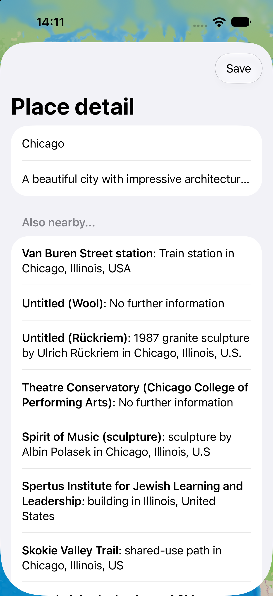
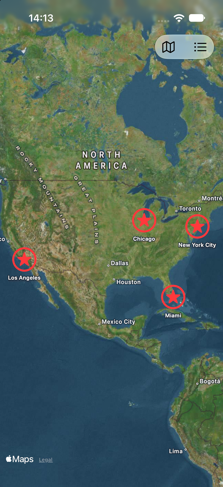
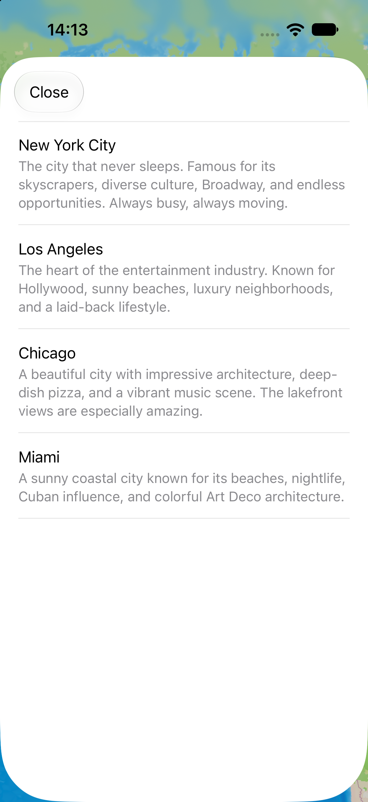

# PlaceMarks

A SwiftUI map app for bookmarking places: unlock with Face ID, drop pins on the map, edit them, see nearby Wikipedia articles, and browse saved places in a list.

> **Note:** This project is based on [100 Days of SwiftUI](https://www.hackingwithswift.com/100/swiftui) by Paul Hudson. The original app and its core idea come from the course. See [Personal changes beyond the course](#personal-changes-beyond-the-course) below for what I changed or added myself.

## Screenshots

| Unlock screen | Map with pins | Place detail |
|:---:|:---:|:---:|
|  |  |  |

| Hybrid map style | Saved places list |
|:---:|:---:|
|  |  |

## Features

- Unlock the app with Face ID or the device passcode; it locks again when the app goes to the background
- Interactive map: tap to drop a pin, long-press a pin to edit its name and description
- "Also nearby" section with Wikipedia articles around the selected place, with loading and error states
- Switch between three map styles: standard, hybrid and imagery
- Saved places list with swipe-to-delete
- Places are saved to disk as JSON and survive app restarts

## Tech stack

- Swift, SwiftUI
- MapKit (`Map`, `MapReader`, `Annotation`)
- LocalAuthentication (`LAContext`)
- UIKit (`UITableViewController`) bridged into SwiftUI with `UIViewControllerRepresentable`
- URLSession, `Codable` (Wikipedia API)
- Observation framework (`@Observable`)
- File storage with `FileManager` / JSON

## Architecture

MVVM, with a separate view model for the map screen and one for the detail screen:

```
PlaceMarks/
├── MyApp.swift
├── Model/        MapLocation, map style option, loading states, Wikipedia response models
├── ViewModel/    ContentViewModel (map state, persistence, auth), DetailViewModel (editing, nearby places)
├── Services/     NetworkHelper (Wikipedia request)
├── UI/           ContentView, DetailView
└── UIKit/        PlacesListViewController, PlacesListView (UIViewControllerRepresentable + Coordinator)
```

- **`ContentViewModel`** owns the list of places, map style, persistence and authentication state.
- **`DetailViewModel`** owns the edited fields and the loading state of nearby places, and reports changes back through a closure.
- **`PlacesListViewController`** talks to SwiftUI through a delegate protocol; the `Coordinator` in `PlacesListView` turns delegate calls into closures.

## Personal changes beyond the course

- **UIKit places list:** a `UITableView`-based screen presented from SwiftUI through `UIViewControllerRepresentable`, with a delegate protocol, a `Coordinator` and swipe-to-delete.
- **Hardened authentication:** the device passcode works as a fallback when Face ID is unavailable (`.deviceOwnerAuthentication`), the app stays locked on any failure and locks again when it goes to the background (`scenePhase`), `LAError` codes are mapped to specific messages (a cancelled prompt shows nothing), and a clear message is shown when no passcode is set.
- **Map style button that cycles through three styles** (standard, hybrid, imagery).

## Requirements

- iOS 17.0+
- Xcode 26 or later

## Running the project

1. Clone the repository
2. Open `PlaceMarks.xcodeproj` in Xcode
3. Select an iPhone simulator or device and press Run

Face ID can be tested in the simulator via *Features → Face ID*.

## Credits

Original app concept and tutorial: [Paul Hudson, Hacking with Swift](https://www.hackingwithswift.com).
